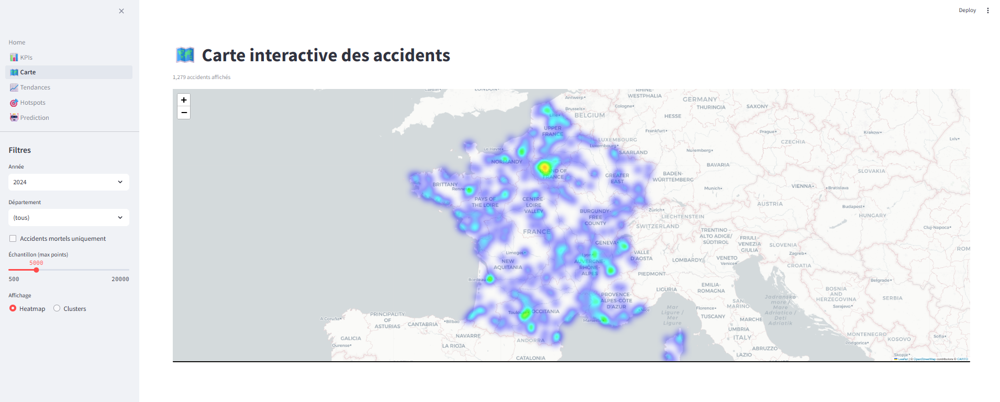
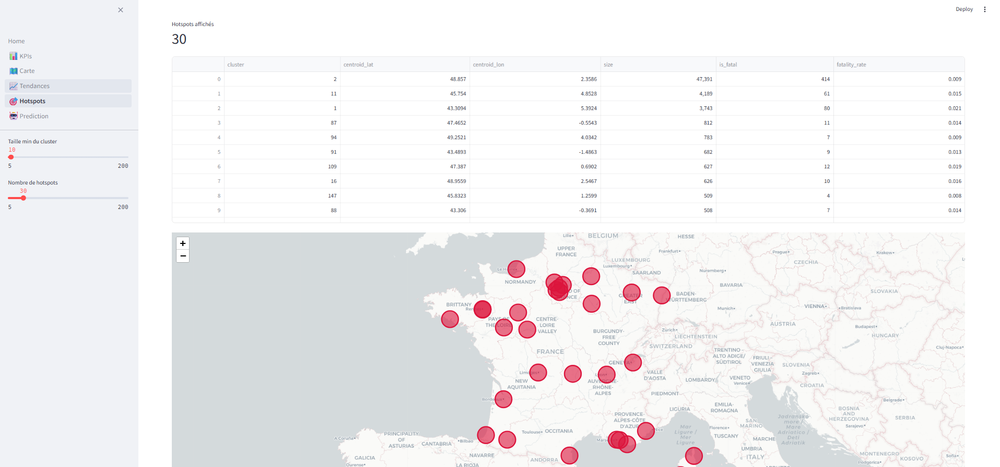
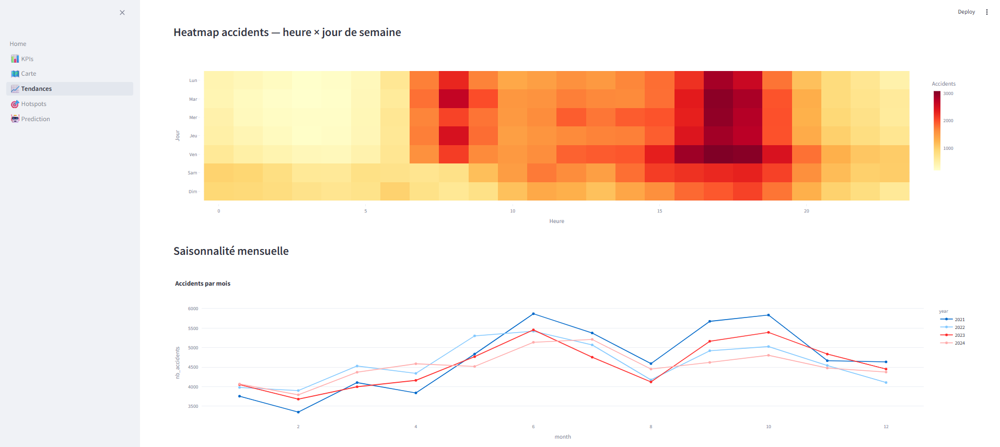

# 🚦 Accidents de la route en France — Pipeline Data End-to-End

[](https://www.python.org/)
[](https://www.getdbt.com/)
[](https://duckdb.org/)
[](https://fastapi.tiangolo.com/)
[](https://streamlit.io/)
[](https://airflow.apache.org/)
[](https://www.docker.com/)
[](.github/workflows/ci.yml)
[](LICENSE)

[]()
[]()
[]()
[]()

> Pipeline data **end-to-end** sur les accidents corporels de la route en France (2021-2024) : extraction depuis les sources ouvertes, modélisation via dbt-duckdb, ML géospatial (DBSCAN + RandomForest), API REST et dashboard interactif.

**[📊 Aperçu du dashboard](#-aperçu-du-dashboard) · [🏗️ Architecture](#️-architecture) · [🚀 Démarrage](#-démarrage) · [📡 API](#-api--exemples)**

---

## 🎯 Vue d'ensemble

Plus de 3 200 personnes meurent chaque année sur les routes françaises. Ce projet construit toute la chaîne data — de l'extraction brute jusqu'au dashboard interactif — pour identifier les zones à risque et prédire la gravité d'un accident selon les conditions du moment.

- **Sources** : ONISR (BAAC) via API `data.gouv.fr` · Open-Meteo (climat 20 départements) · INSEE (population)
- **Volume** : 221 044 accidents corporels, 506 886 usagers, 28 122 lignes météo, 4 années (2021-2024)
- **Sortie** : 1 056 zones à risque détectées, classifieur de gravité ROC-AUC 0.72, dashboard 5 pages

## 📊 Aperçu du dashboard

### 🗺️ Carte interactive — heatmap des accidents en France

[](docs/images/carte.png)

### 🎯 Hotspots — zones à risque détectées par DBSCAN

[](docs/images/hotspots.png)

### 📈 Tendances — saisonnalité horaire et mensuelle

[](docs/images/tendances.png)

---

## ✨ Points forts

- **Extraction résiliente** : découverte dynamique des ressources ONISR via l'API `data.gouv.fr` (parse les URLs stables, pas les titres qui changent à chaque release du dataset).
- **Multi-millésimes robustes** : gestion automatique des changements de schéma (`Num_Acc` → `Accident_Id` en 2022, encodages variables, coordonnées en virgule décimale).
- **Warehouse local zéro-infra** : DuckDB + dbt-duckdb pour prototyper un mini-data-warehouse sans serveur, ni cloud, ni coût.
- **ML géospatial** : DBSCAN haversine pour clustering des accidents à 300 m près, avec filtre métropole pour exclure les DOM-TOM.
- **Classification déséquilibrée** : RandomForest avec `class_weight='balanced'` + `StratifiedKFold` sur problème à 5,8 % de positifs.
- **Production-ready** : tests pytest + 13 tests dbt + Great Expectations + CI GitHub Actions + Docker Compose + pre-commit (ruff, black, mypy).

---

## 🏗️ Architecture

```
┌──────────────────┐    ┌────────────────┐    ┌──────────────────┐
│  data.gouv.fr    │    │  EXTRACT       │    │  TRANSFORM       │
│  ONISR (BAAC)    │───▶│  Python +      │───▶│  pandas +        │
│  Open-Meteo      │    │  requests      │    │  Parquet         │
│  INSEE           │    └────────────────┘    └────────┬─────────┘
└──────────────────┘                                   │
                                                       ▼
┌──────────────────┐    ┌────────────────┐    ┌──────────────────┐
│  STREAMLIT       │◀───│  FastAPI       │◀───│  DuckDB          │
│  5 pages         │    │  4 routers     │    │  warehouse       │
│  + Folium/Plotly │    │  + Pydantic v2 │    │  (in-process)    │
└──────────────────┘    └────────────────┘    └────────▲─────────┘
                                                       │
                              ┌────────────────────────┴─────┐
                              │  dbt-duckdb (7 modèles)      │
                              │  ML (DBSCAN + RandomForest)  │
                              └──────────────────────────────┘

   Airflow (DAG)  ·  GitHub Actions (CI)  ·  Docker  ·  Great Expectations
```

---

## 🛠️ Stack technique

| Couche | Outils |
|---|---|
| **Langages** | Python 3.11, SQL |
| **Extraction** | `requests`, `httpx`, `pandas` |
| **Stockage** | DuckDB, Parquet |
| **Transformations** | dbt-duckdb (staging / intermediate / marts) |
| **Qualité** | Great Expectations, `pytest` |
| **ML** | scikit-learn (DBSCAN haversine, RandomForest, `StratifiedKFold`) |
| **Géospatial** | Folium, GeoPandas, Shapely |
| **API** | FastAPI + Uvicorn + Pydantic v2 |
| **Dashboard** | Streamlit + Plotly + Folium |
| **Orchestration** | Apache Airflow |
| **DevOps** | Docker, docker-compose, GitHub Actions, pre-commit, `ruff`, `black`, `mypy` |

---

## 📐 Sources de données traitées

| Source | Description | Volume |
|---|---|---:|
| **ONISR — caractéristiques** | 1 ligne = 1 accident corporel | 221 044 |
| **ONISR — lieux** | Description du lieu (route, intersection) | 252 928 |
| **ONISR — véhicules** | Véhicules impliqués | 378 071 |
| **ONISR — usagers** | Personnes impliquées (gravité, équipement) | 506 886 |
| **Open-Meteo** | Climat journalier (20 deps × 4 ans) | 28 122 |
| **INSEE** | Population communale | 39 201 |

---

## 🚀 Démarrage

### Prérequis
- Python 3.11+
- (optionnel) Docker + Docker Compose

### Installation

```bash
git clone https://github.com/AbdessamadAouissi/accidents-france-pipeline.git
cd accidents-france-pipeline

python -m venv .venv
.venv/Scripts/activate          # Windows
# source .venv/bin/activate     # Linux/Mac
pip install -r requirements.txt
cp .env.example .env
```

### Pipeline complet (~5 min)

```bash
# 1. Extraction (ONISR + Open-Meteo + INSEE)
python -m src.extract.run_all

# 2. Nettoyage + agrégations
python -m src.transform.run

# 3. Chargement DuckDB
python -m src.load.duckdb_loader

# 4. Transformations dbt (7 modèles)
cd dbt_project && dbt run --profiles-dir . && cd ..

# 5. Entraînement ML (DBSCAN + RandomForest)
python -m src.ml.train_all
```

> Avec `make` : `make pipeline`

### Lancer les services

```bash
# API REST  → http://localhost:8000/docs
uvicorn src.api.main:app --reload --port 8000

# Dashboard → http://localhost:8501
streamlit run dashboard/Home.py
```

### Avec Docker

```bash
docker-compose up -d
# Streamlit  : http://localhost:8501
# FastAPI    : http://localhost:8000/docs
# Airflow UI : http://localhost:8080
```

---

## 📂 Structure

```
.
├── src/
│   ├── extract/        # Extraction ONISR / Open-Meteo / INSEE
│   ├── transform/      # Nettoyage, mappings, dérivés temporels
│   ├── load/           # Loader DuckDB (raw → staging → marts vues)
│   ├── quality/        # Suites Great Expectations
│   ├── ml/             # hotspots.py (DBSCAN), severity_classifier.py (RF)
│   ├── api/            # FastAPI : routers/{kpis,accidents,hotspots,predict}
│   └── utils/          # config (Pydantic Settings), logger (loguru), io
├── dbt_project/
│   ├── models/staging/        # 1:1 sur sources, typages
│   ├── models/intermediate/   # int_accidents_enriched (jointure météo)
│   ├── models/marts/          # fct_accidents, agg_accidents_by_dep, ...
│   └── macros/generate_schema_name.sql  # évite le préfixe "main_"
├── dashboard/          # Home.py + 5 pages (KPIs, Carte, Tendances, Hotspots, Prediction)
├── airflow/dags/       # accidents_pipeline_daily
├── tests/              # pytest (extract, transform, ml, api)
├── data/
│   ├── raw/            # parquet bruts
│   ├── processed/      # tables nettoyées + ml/hotspots_summary.parquet
│   └── warehouse/      # accidents.duckdb
├── models/             # severity_rf.joblib (pickle scikit-learn)
├── docs/
│   └── images/         # screenshots dashboard
└── docker-compose.yml  # API + dashboard + Airflow
```

---

## 🔁 Couches dbt

| Couche | Modèles | Rôle |
|---|---|---|
| **staging** | `stg_accidents`, `stg_meteo`, `stg_severity` | Cast, renommage, 1 ligne = 1 entité |
| **intermediate** | `int_accidents_enriched` | Jointure accidents × météo (sur `dep` × `date`) |
| **marts** | `fct_accidents`, `agg_accidents_by_dep`, `agg_temporal_patterns` | Tables analytiques denormalisées (26 colonnes pour la fact) |

`dbt run` reconstruit les 7 modèles en ~5 s. Tests : `dbt test` (13 tests : `unique`, `not_null`, ranges).

---

## 🤖 Modèles ML

### 1. Hotspots — DBSCAN haversine

- **Filtre métropole** d'abord (bbox lat 41–51.5, lon −5.5 à 10) — exclut DOM-TOM.
- DBSCAN en métrique haversine, ε = 300 m, min_samples = 10.
- **1 056 clusters trouvés** sur 157 561 points.

### 2. Classifieur de gravité — RandomForest

- **Cible** : `is_fatal` (≥ 1 décès), 5,8 % de positifs.
- **Features de base** (toujours dispo) : `hour`, `month`, `day_of_week`, `light_condition`, `weather_condition`, `time_of_day`.
- **Features optionnelles** (depuis dbt) : `temp_max`, `precipitation`, `wind_max`, `weather_category`.
- Pipeline sklearn : `SimpleImputer` + `StandardScaler` (num) / `OneHotEncoder` (cat) + `RandomForest(n=300, max_depth=12, class_weight='balanced')`.
- Évaluation : `StratifiedKFold(5)`, **F1-macro 0.426 ± 0.004**, **ROC-AUC 0.720**.

---

## 📊 Résultats

### KPIs globaux 2021-2024

| Métrique | Valeur |
|---|---:|
| Accidents corporels | **221 044** |
| Tués | 13 599 |
| Blessés hospitalisés | 76 750 |
| Blessés légers | 201 026 |
| Accidents mortels (`is_fatal`) | 12 798 |

### Top 5 hotspots (DBSCAN, ε=300 m, min=10)

| Rang | Zone | Accidents | Mortels | Taux fatalité |
|---:|---|---:|---:|---:|
| 1 | **Paris centre** (48.86, 2.36) | 47 391 | 414 | 0.9 % |
| 2 | **Lyon** (45.75, 4.85) | 4 189 | 61 | 1.5 % |
| 3 | **Marseille** (43.31, 5.39) | 3 743 | 80 | 2.1 % |
| 4 | **Angers** (47.47, −0.55) | 812 | 11 | 1.4 % |
| 5 | **Reims** (49.25, 4.03) | 783 | 7 | 0.9 % |

---

## 📡 API — Exemples

```bash
# KPIs globaux
curl http://localhost:8000/api/v1/kpis
# → {"nb_accidents":221044,"nb_tues":13599,"nb_blesses_hosp":76750, ...}

# Accidents (filtres : year, dep, severity, limit, offset)
curl "http://localhost:8000/api/v1/accidents?limit=3"

# Hotspots (top clusters DBSCAN)
curl "http://localhost:8000/api/v1/hotspots?limit=5"

# Prédiction de gravité
curl -X POST http://localhost:8000/api/v1/predict \
  -H "Content-Type: application/json" \
  -d '{"hour":2,"month":12,"day_of_week":5,
       "light_condition":"nuit_sans_eclairage",
       "weather_condition":"pluie_forte",
       "time_of_day":"nuit"}'
# → {"fatality_probability":0.6562,"risk_level":"élevé","model_version":"severity_rf_v1"}
```

Doc Swagger auto-générée : `http://localhost:8000/docs`.

---

## 🧪 Tests & qualité

```bash
make test        # pytest -v
make lint        # black + ruff + mypy
make ge          # Great Expectations checkpoints
make dbt-test    # 13 tests dbt
```

CI sur push/PR : `lint → test → ge → dbt-test` (voir `.github/workflows/ci.yml`).

---

## 🎓 Ce que ce projet illustre

| Compétence | Mise en pratique dans le projet |
|---|---|
| **Data engineering** | Pipeline end-to-end multi-sources, gestion des changements de schéma multi-millésimes, idempotence (cache local des CSV) |
| **Modélisation analytique** | dbt en couches (staging → intermediate → marts), macro `generate_schema_name` pour éviter le préfixe `main_` |
| **Warehouse OLAP** | DuckDB en mode in-process, vues d'alias entre staging Python et marts dbt pour résilience |
| **Géospatial** | Bounding-box métropole, DBSCAN haversine, agrégation par centroïde, visualisation Folium (HeatMap + MarkerCluster) |
| **Machine learning** | Pipeline sklearn complet avec imputation/scaling/encoding, classes déséquilibrées (`class_weight='balanced'`), validation stratifiée, sélection auto des features non-NaN |
| **API & contrats** | FastAPI + Pydantic v2, validation des entrées, documentation Swagger auto-générée |
| **Visualisation** | Streamlit multi-pages, cartes Folium interactives, graphes Plotly, formulaire de prédiction |
| **Orchestration** | DAG Airflow `accidents_pipeline_daily` avec dépendances explicites |
| **Qualité & CI/CD** | pytest, dbt tests, Great Expectations, GitHub Actions, pre-commit, lint (ruff/black/mypy) |
| **DevOps** | Conteneurisation Docker Compose (API + dashboard + Airflow), variables d'environnement Pydantic Settings |

---

## 📚 Sources de données

| Source | Description | Lien |
|---|---|---|
| **ONISR / BAAC** | Accidents corporels (caractéristiques, lieux, véhicules, usagers) | [data.gouv.fr](https://www.data.gouv.fr/fr/datasets/bases-de-donnees-annuelles-des-accidents-corporels-de-la-circulation-routiere-annees-de-2005-a-2023/) |
| **Open-Meteo** | Climat quotidien (T°, précipitations, vent) — API gratuite | [open-meteo.com](https://open-meteo.com/) |
| **INSEE** | Population communale | [insee.fr](https://www.insee.fr/) |

---

## 🗓️ Orchestration (Airflow)

DAG `accidents_pipeline_daily` :

```
extract_onisr  ─┐
extract_meteo  ─┼─▶ validate_ge ─▶ load_duckdb ─▶ dbt_run ─▶ dbt_test ─▶ train_ml
extract_insee  ─┘
```

`@daily`, retry exponentiel.

---

## 🔭 Limites connues & suite

- **Couverture météo** : 20 départements (zones les plus accidentogènes). À étendre aux 96 pour gagner sur les features ML.
- **Classifieur** : baseline RF — tester XGBoost / LightGBM avec calibration des probas (Platt / isotonic).
- **MLflow** : pas encore intégré (à venir pour le tracking d'expériences).
- **Année 2025** : ONISR a un délai de ~12 mois ; le millésime 2025 sortira fin 2026. Le pattern d'extraction est dynamique — ajouter une année = changer `ONISR_YEARS` dans `.env`.

---

## 📄 Licence

MIT — voir [LICENSE](LICENSE).
